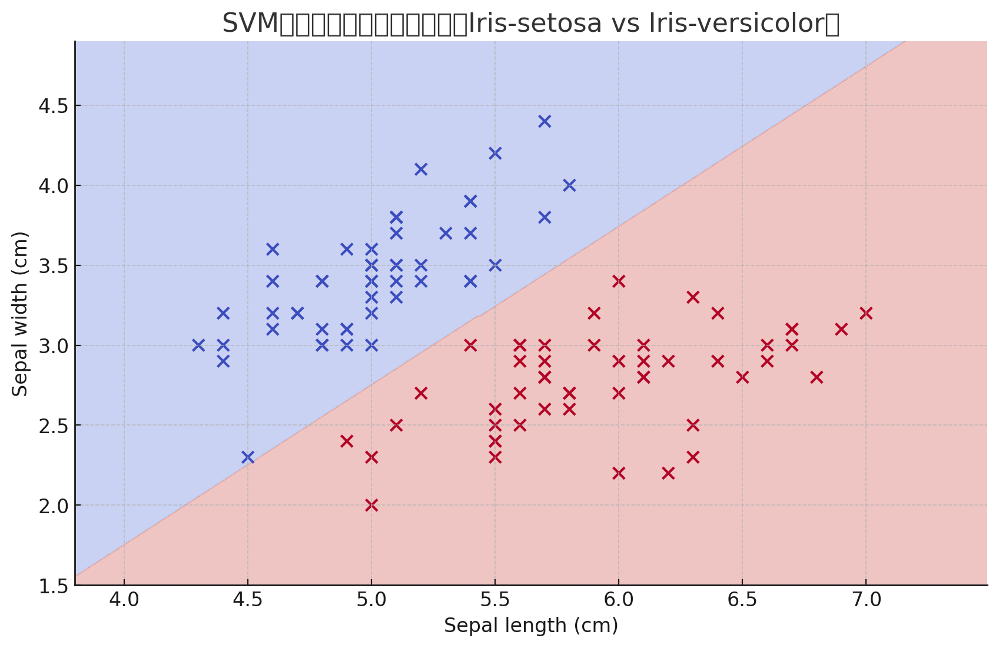

# 3.8 サポートベクトルマシン(SVM)

サポートベクトルマシンは、通常、二値分類問題に適用するため、目的変数は二値となる。例えば花の形状を表す特徴量から花の種類（種類）を分類するなど。

（アイリスデータセットで、花の特徴と種類をプロットした例。XY軸は目的変数、花の種類は色で表現されている）

- **決定境界**: 境界線のこと
- **分離ハイパープレーン**: 境界線のこと
- **サポートベクトル**: 決定境界から最も近い訓練データの点。(イメージ的には、決定境界から点への線)
- **マージン**: サポートベクトルと境界線の距離
- **マージン最大化**: SVMでは、サポートベクトと境界線の距離を**最大化**するように境界線を決定する
- **カーネル**: 非線形なデータを高次元空間に変換するための関数。線形分離不可能なデータも線形に分離できるようになる。
  - 線形カーネル: データをそのまま利用する
  - 多項式カーネル: データを多項式の形で変換
  - ガウス基底関数カーネル(RBF): データを無限次元空間にマッピングする。
- **カーネルトリック**: カーネル方による計算量を削減する技術
- **ソフトマージン**: データのノイズや誤分類を許容するアプローチ。モデルの柔軟性が増す。どの程度、データ点がマージン内へ侵入してもよいか表すパラメータをスラック変数という

サポートベクトルマシンでは、目的変数は1か-1にエンコードする。新しい観測データについて、決定境界を表す式$f(x)$が正を返したら1、そうでなければ-1と予測する。

$$\text{予測クラス} = 
\begin{cases}
1 & \text{if } f(x) > 0 \\
-1 & \text{if } f(x) \leq 0
\end{cases}$$

